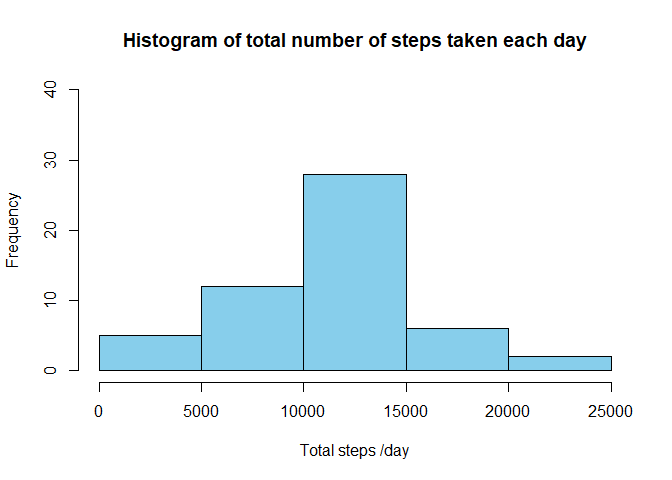
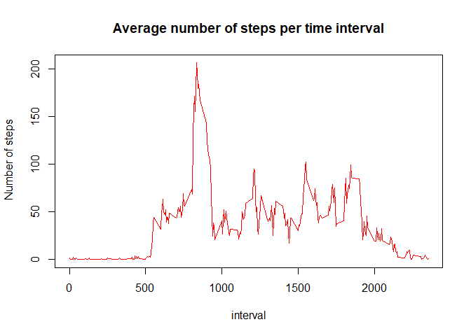
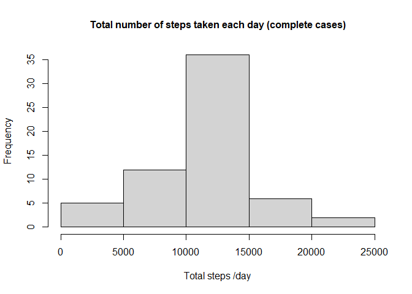
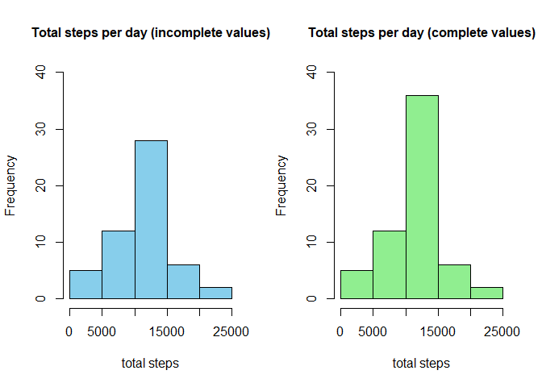
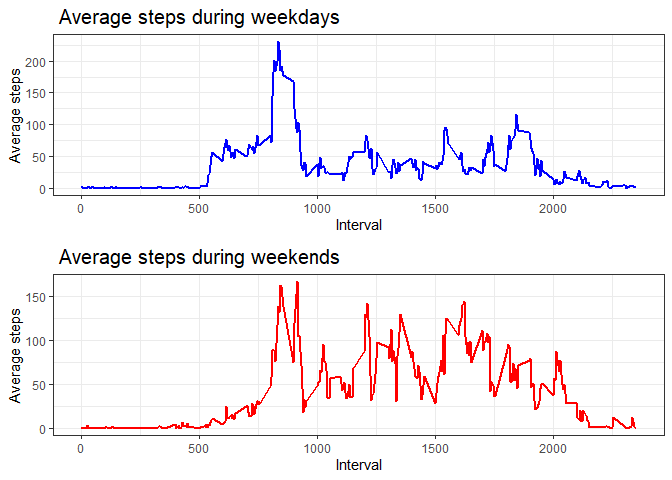

*Pablo Rueda*  

*7/16/2020*

### **Loading and preprocessing the data**

**1. Load the data**

    DF<-read.csv("C:/Users/pdrs8/Desktop/Coursera/Reproducible Research/Course Project 1/repdata_data_activity/activity.csv")

**2.Process/transform the data (if necessary) into a format suitable for
your analysis**

*Libraries are added for future computations, dates are set as Date
Format*

    library(ggplot2)
    library(dplyr)
    library(gridExtra)

    DF$date<-as.Date(strptime(DF$date,"%Y-%m-%d"))

### **What is mean total number of steps taken per day?**

**1.Calculate the total number of steps taken per day**

    ds<-aggregate(DF$steps,by=list(DF$date),sum)
    colnames(ds)<-c("date","steps")

**2.If you do not understand the difference between a histogram and a
barplot, research the difference between them. Make a histogram of the
total number of steps taken each day**

    p1<-hist(ds$steps,xlab="Total steps /day", main="Histogram of total number of steps taken each day",ylim=c(0,40),col="sky blue")

**3.Calculate and report the mean and median of the total number of
steps taken per day**

    mean.ds<-mean(ds$steps,na.rm=TRUE)
    median.ds<-median(ds$steps, na.rm=TRUE)
    print(c("mean"=mean.ds,"median"=median.ds))

    ##     mean   median 
    ## 10766.19 10765.00

### **What is the average daily activity pattern?**

**1.Make a time series plot ( i.e. type = “l”) of the 5-minute interval
(x-axis) and the average number of steps taken, averaged across all days
(y-axis)**

    da<-aggregate(DF$steps,by=list(DF$interval),mean,na.rm=TRUE)
    colnames(da)<-c("interval","steps")
    with(da,plot(steps~interval,type="l", ylab=" Number of steps", main="Average number of steps per time interval", col="red"))

**2.Which 5-minute interval, on average across all the days in the
dataset, contains the maximum number of steps?**

    intmax<-da[da$steps==max(da$steps),]
    intmax<-intmax[1,1]
    print(intmax)

    ## [1] 835

### **Imputing missing values**

**1.Calculate and report the total number of missing values in the
dataset (i.e. the total number of rows with NAs)**

    sum(is.na(DF))

    ## [1] 2304

**2.Devise a strategy for filling in all of the missing values in the
dataset. The strategy does not need to be sophisticated. For example,
you could use the mean/median for that day, or the mean for that
5-minute interval, etc.**

    intna<-which(is.na(DF$steps))
    intna<-DF[intna,]
    a<-merge(intna,da, by="interval")
    a<-data.frame("interval"=a$interval, "date"=a$date, "steps"=a$steps.y)
    a<-arrange(a,date)

**3.Create a new dataset that is equal to the original dataset but with
the missing data filled in.**

    DF[which(is.na(DF$steps)),"steps"]<-a$steps
    ds1<-aggregate(DF$steps,by=list(DF$date),sum)
    colnames(ds1)<-c("date","steps")

**4.Make a histogram of the total number of steps taken each day and
Calculate and report the mean and median total number of steps taken per
day. Do these values differ from the estimates from the first part of
the assignment? What is the impact of imputing missing data on the
estimates of the total daily number of steps?**

    p2<-hist(ds1$steps,xlab="Total steps /day", main="Total number of steps taken each day (complete cases)",cex.main=1.0)

    mean.ds1<-mean(ds1$steps)
    median.ds1<-median(ds1$steps)

*As you may notice, the shape of the histogram is very similar to the
one of the missing values, this is due NA’s values represent about 13%
of the total values, so the effect of them is low in the general
tendence of data. Nevertheless the next values show that replacing the
missing values with the respective 5 min interval mean, improve the
simetry of the curve (less bias) so now the median value correspond to
the mean*

    print(c("mean"=mean.ds1,"median"=median.ds1))

    ##     mean   median 
    ## 10766.19 10766.19

*In order to have a better visualization , I included both histograms in
the plot below.*

    par(mfrow = c(1, 2))
    plot(p1,xlab="total steps",main="Total steps per day (incomplete values)", col="sky blue", ylim=c(0,40),cex.main=1.0)
    plot(p2,xlab="total steps",main="Total steps per day (complete values)", col="light green", ylim=c(0,40),cex.main=1.0)

### **Are there differences in activity patterns between weekdays and weekends?**

**1.Create a new factor variable in the dataset with two levels –
“weekday” and “weekend” indicating whether a given date is a weekday or
weekend day.**

    DF<-transform(DF, "date"=weekdays(date))
    DF$date[DF$date %in% c("Monday","Tuesday","Wednesday","Thursday","Friday")]<-"weekday"
    DF$date[DF$date %in% c("Saturday","Sunday")]<-"weekend"
    DF<-transform(DF,"date"=as.factor(date))

**2.Make a panel plot containing a time series plot (i.e.type = “l”) of
the 5-minute interval (x-axis) and the average number of steps taken,
averaged across all weekday days or weekend days (y-axis).**

    df1<-filter(DF,date=="weekday")
    df1<-aggregate(df1$steps,by=list(df1$interval),mean,na.rm=TRUE)
    colnames(df1)<-c("interval","steps")

    df2<-filter(DF,date=="weekend")
    df2<-aggregate(df2$steps,by=list(df2$interval),mean,na.rm=TRUE)
    colnames(df2)<-c("interval","steps")

    p3<-ggplot(df1,aes(x=interval,y=steps))+geom_line(size=1,color="blue")+theme_bw()+
            labs(y="Average steps", x="Interval", title = " Average steps during weekdays")+
            theme(plot.title = element_text(size=15))

    p4<-ggplot(df2,aes(x=interval,y=steps))+geom_line(size=1,color="red")+theme_bw()+
            labs(y="Average steps", x="Interval", title = " Average steps during weekends")+
            theme(plot.title = element_text(size=15))

    grid.arrange(p3,p4,ncol=1,nrow=2)

